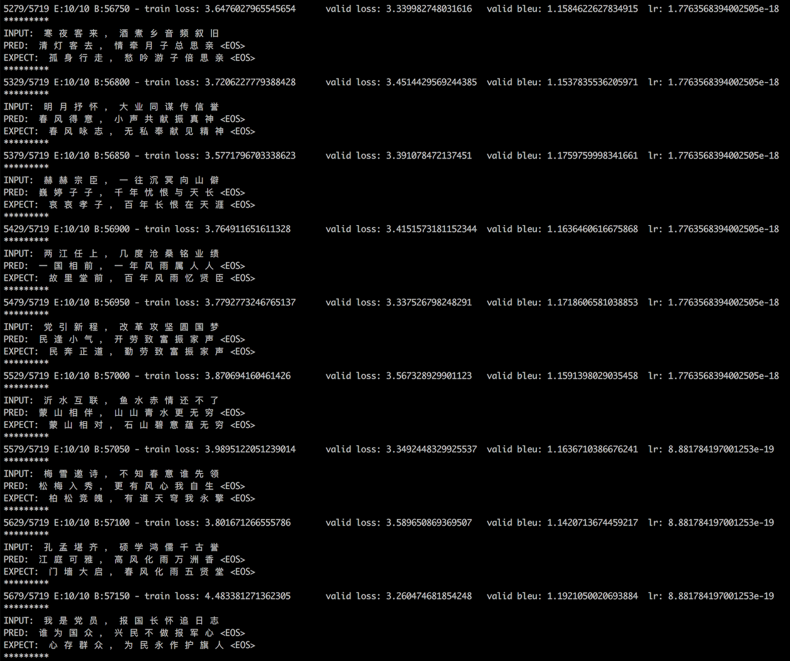
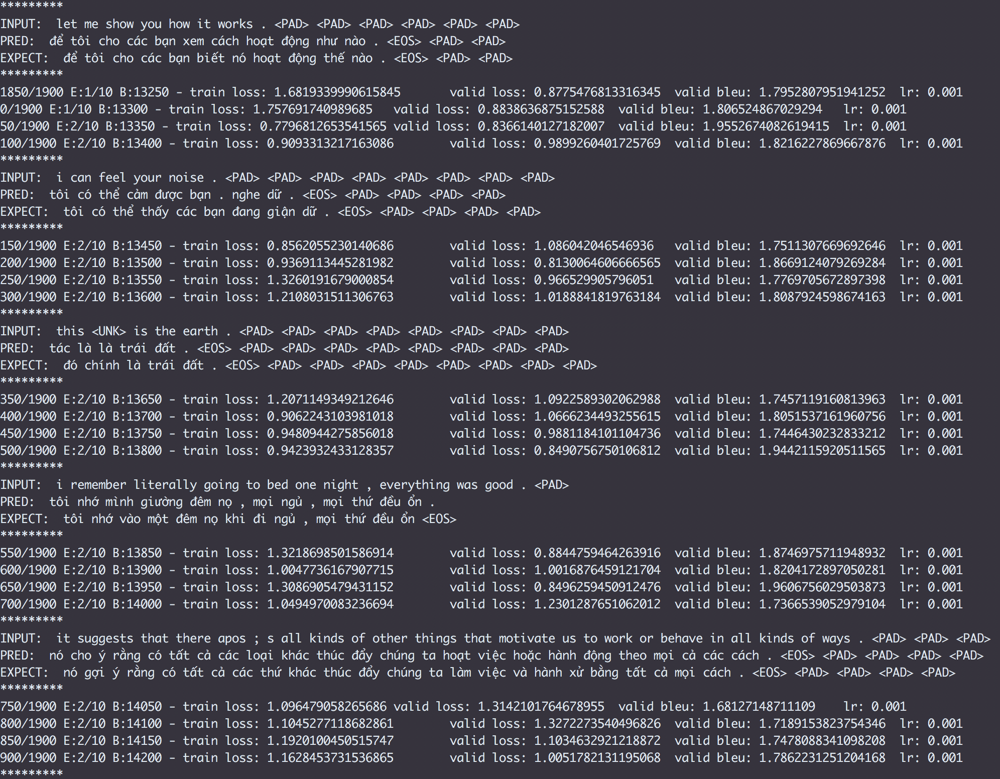

# lite-seq2seq - a super light weight seq2seq core

This project is aimed at creating a super easy way to put a modern seq2seq model in use. We want to keep it simple, handy with sufficient ability to fitting complex sequence transformation process.
The default model equips with bucket, attention mechanism, stack bidirectional encoder and beam search. Experiment on some test translation dataset indicates that the fitting ability of our default model is much better than that of vanilla seq2seq.

- [Prerequisite](#prerequisite)
- [Features](#features)
- [Data format](#data-format)
  * [Data format example](#data-format-example)
- [Text process](#text-process)
  * [Basic usage](#basic-usage)
  * [Customize subprocess](#customize-subprocess)
  * [Other usages](#other-usages)
- [Use Seq2seq in your code](#use-seq2seq-in-your-code)
  * [Basic usage](#basic-usage-1)
  * [Load model for prediction](#load-model-for-prediction)
  * [Load existed model and continue training](#load-existed-model-and-continue-training)
  * [Change the hyperparameters](#change-the-hyperparameters)
- [Use Seq2seq via CLI](#use-seq2seq-via-cli)
  * [Start training](#start-training)
  * [Continue training](#continue-training)
  * [Prediction](#prediction)
  * [Customize the model for training](#customize-the-model-for-training)
- [Tensorboard](#tensorboard)
- [Evaluation](https://github.com/pyeprog/lite-seq2seq#evaluation)
  * [couplet](#the-result-of-training-on-couplet-dataset)
  * [English to Vietnamese](#the-result-of-training-on-english-to-vietnamese-dataset)


## Prerequisite
- Only Tensorflow (>1.4)

## Features
- Single file module,which means only liteSeq2Seq.py is necessary. Super easy to bring its power to other projects.
- Only 1 dependency -- tensorflow. It's safe to be stable version(>1.4). Version earlier than that has not been tested.
- Super simple API. You can remember them in seconds, `train` and `predict`.
- Flexibility remains. You can tune the model as much as you want. Nearly all parameters are configurable.
- An CLI app inside, which means you can play with it as soon as you get tensorflow installed.
- Nice ability to fit complex sequence transformation such as translation, chat or create couplet if you please.

## Data Format
Unfortunately, our model can only parse data in special format. Not so special actually :)
For seq2seq model receive sequence A and learn to return sequence B, our model can ONLY use two files as traning input, with one file containing all sequence A's, one sequence at a line and the other containing all sequence B's, one sequence at a line.
### Data Format Example
for model to learn how to transform English sequence A -> French sequence B
FILE that contain all English sequence A's
```
new jersey is sometimes quiet during autumn , and it is snowy in april .
the united states is usually chilly during july , and it is usually freezing in november .
california is usually quiet during march , and it is usually hot in june .
the united states is sometimes mild during june , and it is cold in september .
```

FILE that contain all French sequence B's
```
new jersey est parfois calme pendant l' automne , et il est neigeux en avril .
les états-unis est généralement froid en juillet , et il gèle habituellement en novembre .
california est généralement calme en mars , et il est généralement chaud en juin .
les états-unis est parfois légère en juin , et il fait froid en septembre .
```

There is a text processor inside liteSeq2Seq module called TextProcessor, so you can leave to it those trivial treadmill, such as process those punctuations with some seperated from text and others removed.
The only thing you should keep in mind is to ensure lines in both files are correlated. You can check it out in example above, line 1 of A file relates to line 1 of B file, line 2 of A file relates to line 2 of B file, etc.
To make lines correlated also means number of lines of both file should be equal. If not, it will raise an error.

## Text Process
As mentioned earlier, there is a simple text processor called TextProcessor inside the module, which might offer some help processing the text.
### Basic usage
```python
# Basic usage: 
# read from file, process each line and save the processed text in the same 'file_path'
# The origin file will be renamed 'file_path.origin'
tp = TextProcessor()
tp.read(file_path).process(inplace=True)
```
As default the text process includes several subprocesses below:
1. Remove all (), [], {} and text within them.
2. Transfer all x.x. or x.x to xx. For instance, p.m. -> pm or A.M to AM
3. Transfer : - / \ * & $ # @ ^ and ... alike(more than 2 dots) to ' '
4. Seperate text and the punctuations such as `yes,` `good.` `amazing!` `pardon?` `cool;` to `yes , ` `good . ` `amazing ! ` `pardon ? ` `cool ; `
5. Remove singular = < > " ` ( ) [ ] { } that float in text
6. Remove those singular ' that float in text. Those ' form words, like Lily's, o'clock will remain.

Subprocesses will be executed in sequence. 

### Customize subprocess
In some case you want to add more subprocess method or build your own process methods stack, it's relatively simple to do so.
```python
# You own method for example
def proc1(string):
  return string.lower()

def proc2(string):
  return string.replace('_', '-')

tp = TextProcessor()
tp.append(proc1)
tp.append(proc2)

# Process the file1 with default methods + proc1 + proc2
tp.read(file1_path).process(inplace=True)

# Process file2 with only proc1 and proc2, 
tp.read(file2_path).process(proc_fn_list=[proc1, proc2], inplace=True)
```

### Other usages
```python
tp = TextProcessor()

# Overwrite the processed content into origin file, thus no file_path.origin will not be generated 
tp.read(file_path).process(inplace=True, overwrite=True)

# If you want to get the processed content instead of writing content into file, you can do
# content_lines will be a list of strings. Each string represents one line of the file.
content_lines = tp.read(file_path).process(inplace=False)

# Custom methods are available
new_content_lines = tp.read(file_path).process([proc1, proc2], inplace=False)

# Process only a single string
processed_string = tp.process_str(string_of_one_line)

# Custom methods are also available
processed_string = tp.process_str(string_of_one_line, proc_fn_list=[proc1, proc2])
```


## Use Seq2seq in your code
### Basic usage
```python
from liteSeq2Seq import Seq2seq
from liteSeq2Seq import TextProcessor

# Process the text if you need
tp = TextProcessor()
tp.read('input_str_file').process(inplace=True)
tp.read('target_str_file').process(inplace=True)

model = Seq2seq()
model.train('input_str_file', 'target_str_file')
encode_str = input()
prediction_str = model.predict(encode_str)
```

It's very simple to use Seq2seq, under default hyper-parameters, you just need to specify two file path to train method and use predict method to transform text. 
After training, you model will be saved automatically at `<liteSeq2Seq.py dir>/models/<model_id>`. 

If you want to save the model to other dir. Use `Seq2seq.set_model_dir('new_dir')` before creating instance of Seq2seq. 

Use `model.get_id()` to get your model's default id. The default id will be a unique sequence of 20 numbers

Use `model.set_id(new_id)` to set your own id. The default id will be overwrited.

### Load model for prediction
```python
model = Seq2seq()
model.load('./models/<pre_trained_model_id>')
encode_str = input()
prediction_str = model.predict(encode_str)
```

### Load existed model and continue training
```python
model = Seq2seq()
model.train('other_input_str_file', 'other_target_str_file', './models/<pre_trained_model_id>')
```

### Change the hyperparameters
```python
# Hyperparameters
model = Seq2seq(
    embedding_dim=512,
    rnn_layer_size=1024,
    n_rnn_layers=3, 
    beam_width=3, 
    keep_prob=0.8, 
    valid_portion=0.05, 
    train_batch_size=32, 
    infer_batch_size=1, 
    max_gradient_norm=5.0, 
    epoch=10,
    max_global_step=float('inf'),
    learning_rate=1e-3,
    decay_rate=0.5,
    decay_every=1e3,
    decay_start_at=8e3,
    n_buckets=50,
    vocab_remain_rate=0.97,
    bleu_max_order=4,
    bleu_smooth=True,
    report_every=50,
    show_every=200,
    summary_every=50,
    save_every=500
    )
```
| Hyperparameter    | Type      | Description                                                  |
| ----------------- | --------- | ------------------------------------------------------------ |
| embedding_dim     | int       | Embedding layer size                                         |
| rnn_layer_size    | int       | Single lstm layer size, EVEN NUMBER ONLY, set for both encoder and decoder |
| n_rnn_layers      | int       | Number of layers of lstm network, set for both encoder and decoder |
| beam_width        | int       | Width of beam search                                         |
| keep_prob         | float     | Keep probability for each rnn node                           |
| valid_portion     | float     | Portion seperated for validtion                              |
| train_batch_size  | int       | Batch size while training                                    |
| infer_batch_size  | int       | Batch size while infering                                    |
| max_gradient_norm | float     | Clip value for global gradients                              |
| epoch             | int       | Number of training epoch                                     |
| max_global_step   | int/float | Maximum training steps, default to infinity, which means training for {epoch} times |
| learning_rate     | float     | The learning rate                                            |
| decay_rate        | float     | The decay rate of learning rate                              |
| decay_every       | int       | For every {this} steps, learning_rate=learning_rate * decay_rate |
| decay_start_at    | int       | The learning rate begin to decay after training {this} number of steps |
| n_buckets         | int       | Seperate training sequence into {this} buckets, training sequences in same bucket have similar length |
| vocab_remain_rate | float     | Choose a vocab size that can cover {this} percentage of total words |
| bleu_max_order    | int       | the max order for n-gram                                     |
| bleu_smooth       | int       | whether use smoothed bleu score. 1=use, 0=not use. If 0, 0.0 would be more frequent in bleu score |
| report_every      | int       | Print validation score for every {this} steps                |
| show_every        | int       | Print example of transformation for every {this} steps       |
| summary_every     | int       | Save summery info for tensorboard for every {this} steps     |
| save_every        | int       | Save checkpoint for every {this} steps                       |

## Use Seq2seq via CLI
In terminal you can enter `python liteSeq2Seq.py -h` or `python liteSeq2Seq.py --help` for more info. 
### Start training
If you specify --enc, --dec, you will start to train a new model
```terminal
python liteSeq2Seq.py --enc 'path of input_str_file' --dec 'path of output_str_file'
```

### Continue training
If you specify --enc, --dec, --model, you will continue training existed model. Enter absolute path for --model.
```terminal
python liteSeq2Seq.py --enc 'path of input_str_file' --dec 'path of output_str_file' --model './models/model_id'
```

### Prediction
Specify --model to load a existed model, Specify --input for one-line prediction; Specify --loop for continuous prediction.
```terminal
python liteSeq2Seq.py --model './models/model_id' --input 'hello there'
python liteSeq2Seq.py --model './models/model_id' --loop
```

### Customize the model for training
Specify hyperparameters with --hyperparameters. For example, you want to specify beam_width, just add `--beam_width 10`
```terminal
python liteSeq2Seq.py --enc 'path of input_str_file' --dec 'path of output_str_file' --beam_width 10 --save_every 20 --keep_prob 0.5
```

## Tensorboard
Tensorboard is available and information is gathered for every {summary_every} steps. Summary info of each model is saved beside its checkpoint file.
You can simply launch tensorboard sever in terminal. Specify --logdir with the path you save your models in.

```terminal
tensorboard --logdir .models/
```

## Evaluation
### The result of training on couplet dataset
Thank wb14123 for the [couplet dataset](https://github.com/wb14123/couplet-dataset)
- Size of the training set: 700,000
- Number of training epochs: 10
- Training batch size: 128
- Vocab_remain_rate: 1.0 (all Chinese character is used)



---

### The result of training on English to Vietnamese dataset

The dataset comes from IWSLT. You can download them directly using script from [tensorflow/nmt](https://github.com/tensorflow/nmt/tree/master/nmt/scripts) project on github.
- Size of the training set: 130,000
- Number of training epochs: 10
- Training batch size: 64
- vocab_remain_rate: 0.97



> Authors: Weilong Liao, Yimo Wang
